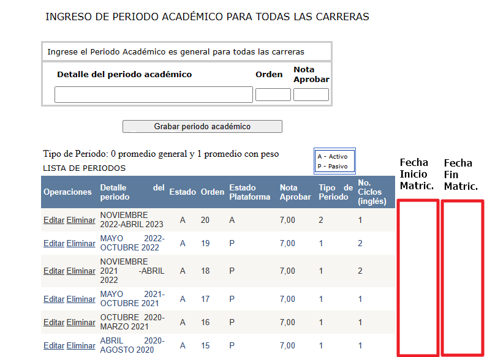
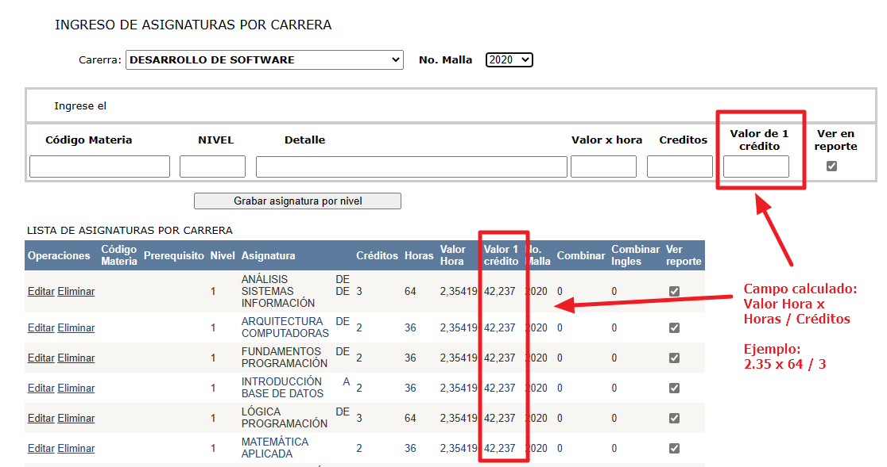
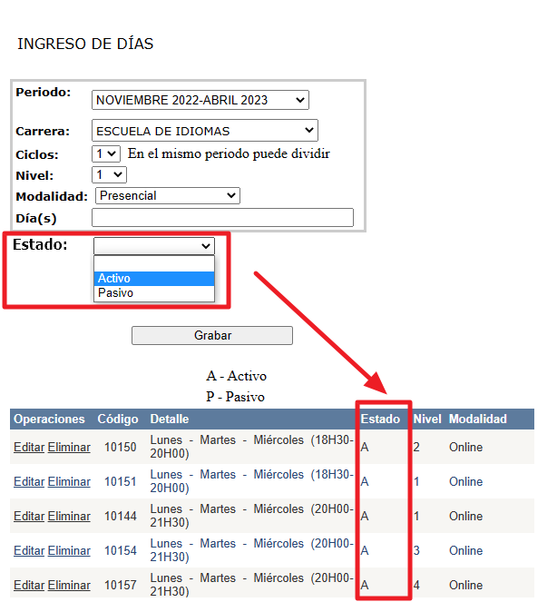

#Ejercicios para la prueba del equipo del Sistema Académico

##Contenido

[Periodos académicos](#periodos-académicos)

[Pantalla: PeriodosAcademicos.aspx](#pantalla-periodosacademicosaspx)

[Asignaturas](#asignaturas)

[Pantalla: IngresarMaterias.aspx](#pantalla-ingresarmateriasaspx)

[Días para la matrícula](#días-para-la-matrícula)

[Pantalla: IngresoDiasMatricula.aspx](#pantalla-ingresodiasmatriculaaspx)

[Registro en línea de la matrícula de inglés](#registro-en-línea-de-la-matrícula-de-inglés)

[Pantalla: inscripcion.aspx](#pantalla-inscripcionaspx)

[Profesor nuevo](#profesor-nuevo)

[Pantalla: IngNuevoDocente.aspx](#pantalla-ingnuevodocenteaspx)

# Acceso a la base de datos de pruebas

Server name: SQL8002.site4now.net

Login: db_a93eed_itq_admin

Password: Itq_2023

# Acceso al repositorio del código

Sitio GitHub con el código: <https://github.com/vmejiaec/SA-ITQ>

# Periodos académicos

## Pantalla: PeriodosAcademicos.aspx

Agregar la fecha de inicio y final del período de matrículas

Fecha_Inicio_Matriculas, Fecha_Fin_Matriculas

# Asignaturas

## Pantalla: IngresarMaterias.aspx

Agregar la opción de añadir el número de horas a elegir entre los valores de 36 o 64, y el cálculo del valor del crédito, como resultado de la operación con los datos del valor hora y el número de horas.

# Días para la matrícula

## Pantalla: IngresoDiasMatricula.aspx

Permitir elegir los estados entre una lista que tenga las opciones A – Activo, P – Pasivo

# Registro en línea de la matrícula de inglés

## Pantalla: inscripcion.aspx

Esta pantalla debe consulta a la base, a la tabla de períodos académicos, para saber si existe un período de matrículas vigente a la fecha actual, si es así, debe permitir continuar con un mensaje que indique las fechas de inicio y fin del período de matrículas; y, caso contrario, que presente la información de las fechas, pero con el aviso que el período a vencido y no permita utilizar la pantalla.

# Profesor nuevo

## Pantalla: IngNuevoDocente.aspx

El logo debe ser actualizado con el nuevo logo.

Antes de grabar hay que validar que el correo sea el correo institucional, esto es, que termine con @itq.edu.ec. Hay que presentar un mensaje de error adecuado que avise al usuario que el correo no es institucional.
